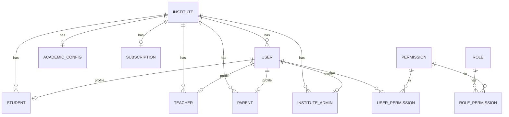
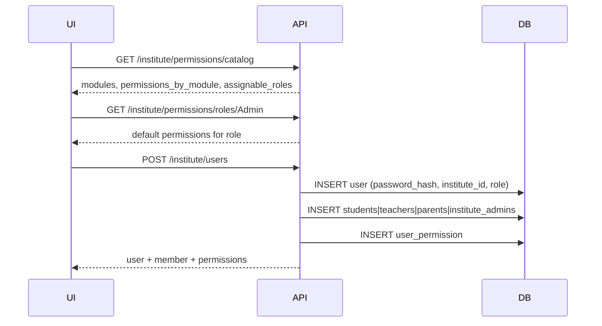

# Diyaa Backend — Project Overview & Flow Document

> Last updated: May 2026  
> Stack: NestJS 11 · TypeORM · PostgreSQL · JWT · bcrypt  
> Base URL (dev): `http://localhost:3000`

---

## 1. Project summary

Diyaa backend ek **multi-tenant school / institute platform** hai:

- **SuperAdmin** — poori platform (schools, revenue, subscriptions)
- **Institute Owner** — apni school register kare, users banaye, dashboard dekhe
- **Institute roles** — Admin (Principal/Sub-admin), Teacher, Student, Parent
- **RBAC** — har user ke paas permissions (role template + custom override)

---

## 2. Folder structure (modules)

```
src/
├── main.ts                          # Bootstrap + RBAC/SuperAdmin seeds
├── app.module.ts
├── common/                          # Guards, decorators, JWT util
├── Permissions/                     # permission, role_permission, user_permission
├── seed/
│   ├── institute-rbac.seed.ts       # Roles + permissions catalog seed
│   ├── institute-permissions.catalog.ts
│   └── superadmin.seed.ts
└── modules/
    ├── auth/                        # POST /auth/login
    ├── users/                       # User entity (login account)
    ├── roles/                       # Role definitions (DB)
    ├── admin/                       # SuperAdmin platform APIs
    ├── institute/                   # Register, dashboard, user CRUD, permissions
    │   ├── entities/                # class-section, billing, content, metrics…
    │   ├── dto/
    │   ├── institute-members.service.ts   # Orchestrator → role modules
    │   └── institute-dashboard.service.ts
    ├── student/                     # students table + StudentService
    ├── teacher/                     # teachers table + TeacherService
    ├── parent/                      # parents table + ParentService
    ├── institute-admin/           # institute_admins table
    └── rbac/                        # InstitutePermissionsService export
```

---

## 3. Database — tables & relationships

### 3.1 Core platform

| Table | Entity | Purpose |
|-------|--------|---------|
| `user` | `User` | **Login account** — email, password_hash, role enum, institute FK |
| `institute` | `Institute` | School record — name, owner_email, city, school_id, … |
| `academic_config` | `AcademicConfig` | Grades, student/teacher ranges per institute |
| `subscription` | `Subscription` | Plan, trial, billing per institute |
| `role` | `Role` | RBAC role names (SuperAdmin, Owner, Admin, …) |
| `permission` | `Permission` | Permission catalog (users_view, fees_manage, …) |
| `role_permission` | `RolePermission` | Default permissions per role |
| `user_permission` | `UserPermission` | Per-user permission override |

### 3.2 Role profile tables (normalized modules)

Har institute user ke liye **User** (auth) + **role table** (profile):

| Table | Module | Links |
|-------|--------|-------|
| `students` | `student/` | `institute_id`, `user_id` (unique) |
| `teachers` | `teacher/` | `institute_id`, `user_id` (unique) |
| `parents` | `parent/` | `institute_id`, `user_id` (unique) |
| `institute_admins` | `institute-admin/` | `institute_id`, `user_id` (unique) |

**Password** sirf `user.password_hash` mein (bcrypt). Role tables mein name/email copy (reporting/dashboard).

### 3.3 Institute dashboard (demo / analytics data)

| Table | Purpose |
|-------|---------|
| `class_section` | Grades, sections, branch, student_count, teacher_names |
| `institute_content` | Content library |
| `billing_invoice` | Billing history |
| `daily_activity` | Activity chart |
| `subject_metric` | Subject performance |
| `engagement_insight` | Insight messages |

### 3.4 ER diagram (simplified)



---

## 4. Roles — kaun kya hai

| Role (`User.role`) | Level | Description |
|--------------------|-------|-------------|
| `SuperAdmin` | Platform | Product owner — `.env` se seed, public register nahi |
| `Owner` | Institute | School register karne wala — full institute control |
| `Admin` | Institute | Principal / Sub-admin — UI mein "Sub Admin" = **Admin** |
| `Teacher` | Institute | Classes, content, assignments (assigned scope) |
| `Student` | Institute | Apna learning, assignments submit |
| `Parent` | Institute | Linked child data (permissions ready, link table abhi pending) |

### 4.1 Owner kya roles assign kar sakta hai

`POST /institute/users` par sirf:

- `Admin`, `Teacher`, `Student`, `Parent`

`Owner` aur `SuperAdmin` assign nahi (Owner sirf registration se; SuperAdmin seed se).

### 4.2 Access control (institute scope)

| Action | SuperAdmin | Platform Admin* | Owner | Inst. Admin | Teacher / Student / Parent |
|--------|------------|-----------------|-------|-------------|---------------------------|
| View institute | ✅ | ✅ | ✅ apni | ✅ apni | ✅ apni (linked) |
| Manage users | ✅ | ✅ | ✅ | ✅ | ❌ |
| Create users | ✅ | ✅ | ✅ | ✅ | ❌ |

\*Note: `UserRole.Admin` enum platform + institute principal dono ke liye use hota hai — `GET /institute` par institute Admin ko theoretically sab institutes dikh sakti hain; **UI ke liye `GET /institute/dashboard/:id` prefer karo.**

---

## 5. Permissions (RBAC) flow

### 5.1 Seed (startup)

`main.ts` → `seedInstituteRBAC()`:

1. `role` table — 6 roles
2. `permission` table — `institute-permissions.catalog.ts` se ~40+ permissions
3. `role_permission` — har role ke default permissions

### 5.2 User ko permissions kaise lagti hain

```mermaid
flowchart TD
    A[User create / role change] --> B{permissions[] body mein?}
    B -->|Haan| C[filterPermissionsForRole]
    B -->|Nahi| D[applyRoleDefaultsToUser]
    C --> E[user_permission table save]
    D --> E
    F[Login] --> G[getUserPermissions]
    G --> H{user_permission rows?}
    H -->|Haan| I[User overrides]
    H -->|Nahi| J[Role defaults from role_permission / catalog]
```

### 5.3 Login response (frontend menus)

```json
{
  "access_token": "...",
  "user": { "user_id", "name", "email", "role", "status", "profile": {} },
  "permissions": ["users_view", "fees_manage", ...],
  "permissions_by_module": {
    "users": ["users_view", "users_create"],
    "fees": ["fees_manage"]
  }
}
```

Frontend: `permissions.includes('users_create')` se menu/button show/hide.

---

## 6. Main business flows

### 6.1 Institute registration

```http
POST /institute/register
```

**DB mein create hota hai:**

1. `institute` row (+ `school_id` auto)
2. `user` — Owner (password_hash)
3. `user_permission` — Owner defaults (sab permissions)
4. `academic_config`
5. `subscription` (trial)
6. Optional: `user` — Principal (`role: Admin`) + `institute_admins` profile
7. Dashboard seed data (classes, invoices, …)

**Response:** `access_token` + institute + academic + subscription.

---

### 6.2 Owner login

```http
POST /auth/login
{ "email", "password" }
```

→ JWT + user + permissions.

---

### 6.3 Owner — user create (full flow)



**Example body:**

```json
{
  "name": "Ali Khan",
  "email": "ali@school.com",
  "password": "secret123",
  "role": "Admin",
  "branch": "Main Campus",
  "permissions": ["users_view", "users_create", "fees_manage"]
}
```

`permissions` omit → role ke **default template** auto apply.

---

### 6.4 Institute + users fetch (sirf apni school)

| API | Use case |
|-----|----------|
| `GET /institute` | Institute object + `users[]` (Owner: apni school only) |
| `GET /institute/dashboard/{id}` | Full dashboard + `users[]` har ek ke sath `permissions[]` |
| `GET /institute/register/{id}` | Registration detail + users + academic + subscription |

**⚠️ URL:** `/institute/dashboard/10` — colon mat lagao (`:10` galat hai).

---

## 7. API reference (implemented)

### Auth

| Method | URL | Auth | Description |
|--------|-----|------|-------------|
| POST | `/auth/login` | — | Login + permissions |

### Institute — public

| Method | URL | Auth | Description |
|--------|-----|------|-------------|
| GET | `/institute/registration-options` | — | Registration form options |
| POST | `/institute/register` | — | New school signup |

### Institute — protected (JWT)

| Method | URL | Description |
|--------|-----|-------------|
| GET | `/institute` | Actor ki institute(s) + users |
| GET | `/institute/dashboard/:id` | Dashboard + users + permissions |
| GET | `/institute/register/:id` | Registration detail |
| DELETE | `/institute/register/:id` | Delete institute |
| GET | `/institute/permissions/catalog` | All permissions |
| GET | `/institute/permissions/roles/:role` | Role default permissions |
| POST | `/institute/users` | Create user + role profile |
| GET | `/institute/users/:userId/permissions` | User permissions |
| PATCH | `/institute/users/:userId/permissions` | Update permissions |
| PATCH | `/institute/users/:userId/role` | Change role (+ optional permissions) |
| PATCH | `/institute/users/:userId/status` | active / inactive |
| DELETE | `/institute/users/:userId` | Delete user + profiles |
| POST | `/institute/classes/:classId/assign-teacher` | Class teacher assign |
| POST | `/institute/classes/:classId/assign-students` | Student count update |
| POST | `/institute/content/:contentId/assign` | Content assign |

### SuperAdmin platform

| Method | URL | Role | Description |
|--------|-----|------|-------------|
| GET | `/admin/overview` | SuperAdmin | Platform stats |
| GET | `/admin/subscriptions-revenue` | SuperAdmin | Revenue |
| GET | `/admin/schools` | SuperAdmin | Schools list |
| GET | `/admin/institutes` | SuperAdmin | All institutes + details |
| GET | `/institute/all/details` | SuperAdmin, Admin | All institutes detailed |

### Users

| Method | URL | Description |
|--------|-----|-------------|
| POST | `/users` | Public-style user create (generic) |
| GET | `/users/me` | JWT — current profile |
| GET | `/users` | SuperAdmin / Admin — all users |

---

## 8. Kaam jo ab tak ho chuka hai ✅

- [x] NestJS + PostgreSQL + TypeORM setup
- [x] JWT auth + login permissions response
- [x] Institute registration (owner, academic, subscription, optional principal)
- [x] Institute dashboard (stats, users, classes, content, billing seeds)
- [x] RBAC — permission catalog, role defaults, per-user overrides
- [x] Owner user CRUD (create, status, role, permissions, delete)
- [x] SuperAdmin seed + platform admin APIs
- [x] **Normalized role modules:** `student/`, `teacher/`, `parent/`, `institute-admin/`
- [x] Role profile tables (`students`, `teachers`, `parents`, `institute_admins`) with `institute_id`
- [x] `POST /institute/users` → User + matching profile table + permissions
- [x] Principal on register → `institute_admins` row
- [x] CORS, Helmet, Throttler, ValidationPipe

---

## 9. Agay karna hai (planned) 📋

### Backend

- [ ] **Role-specific dashboards APIs** — `GET /student/me`, teacher dashboard, parent dashboard
- [ ] **List APIs per role** — `GET /institute/:id/students`, `/teachers`, `/parents`, `/admins`
- [ ] **Parent ↔ Student link** table (`parent_student`) — child attendance/reports ke liye
- [ ] **Teacher ↔ Class** — `teacher_names` strings ki jagah `user_id` FK
- [ ] **Permission guard** — endpoints par `@RequirePermission('users_create')` decorator
- [ ] **Fix `GET /institute`** — institute `Admin` ko sirf apni institute dikhe (platform vs institute role split)
- [ ] **Migrations** — production ke liye TypeORM migrations (`synchronize: false`)
- [ ] **Email invite / activation** — principal `pending_activation` flow complete karna
- [ ] **Password reset / change password** APIs

### Frontend (integration)

- [ ] Login → token + permissions store
- [ ] Owner: `GET /institute` → `instituteId` → `GET /institute/dashboard/{id}`
- [ ] Add User modal: catalog + role defaults + `POST /institute/users`
- [ ] Permission-based sidebar (`permissions_by_module`)
- [ ] Role label: UI "Sub Admin" → API `"Admin"`

---

## 10. Environment variables

| Variable | Purpose |
|----------|---------|
| `PORT` | Server port (default 3000) |
| `DB_*` | PostgreSQL connection |
| `JWT_SECRET` | JWT signing (prod: required, 32+ chars) |
| `JWT_EXPIRES_SEC` | Token lifetime |
| `CORS_ORIGINS` | Frontend origins |
| `TYPEORM_SYNC` | Dev: auto schema sync |
| `SUPERADMIN_EMAIL` / `SUPERADMIN_PASSWORD` | Platform owner seed |
| `NODE_ENV` | production → sync off |

---

## 11. UI integration cheat sheet

```ts
const API = 'http://localhost:3000';

// 1. Login
const { access_token, user, permissions, permissions_by_module } =
  await post('/auth/login', { email, password });

// 2. Institute id
const [institute] = await get('/institute', token);

// 3. Dashboard + users
const dash = await get(`/institute/dashboard/${institute.id}`, token);
const users = dash.users; // har user.permissions[]

// 4. Add user
await post('/institute/users', token, {
  name, email, password,
  role: 'Admin', // not "Sub Admin"
  permissions: optionalArray,
});
```

---

## 12. Important notes

1. **Role enum values:** `"SuperAdmin" | "Owner" | "Admin" | "Teacher" | "Student" | "Parent"` — exact casing.
2. **Dashboard URL:** `/institute/dashboard/10` ✅ — `/institute/dashboard/:10` ❌
3. **Do tables per user:** `user` (login) + `students|teachers|parents|institute_admins` (profile).
4. **Seeds:** Server start par RBAC + SuperAdmin (agar `.env` set ho).

---

## 13. Related files (quick links)

| Topic | File |
|-------|------|
| Permission catalog | `src/seed/institute-permissions.catalog.ts` |
| RBAC seed | `src/seed/institute-rbac.seed.ts` |
| User create logic | `src/modules/institute/institute-dashboard.service.ts` |
| Profile orchestrator | `src/modules/institute/institute-members.service.ts` |
| Access rules | `src/modules/institute/institute-access.service.ts` |
| Routes | `src/modules/institute/institute.controller.ts` |

---

*Document maintained for Diyaa backend team — update jab naye APIs ya tables add hon.*
